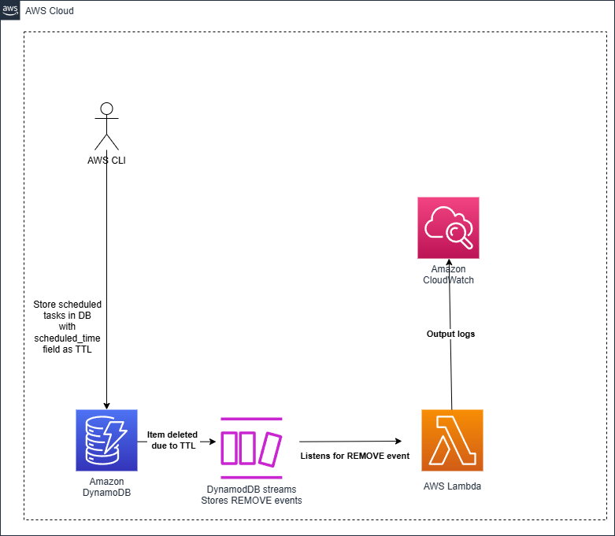

# Dynamodb_streams_ttl

This project sets up an AWS infrastructure using Terraform to create a DynamoDB table which  moves the deleted items due to TTL to DynamoDB stream as and REMOVE event.
This events are processed by Lambda functions.




## Project Structure

- `main.tf`: Contains the main configuration for the Terraform infrastructure, defining the AWS EventBridge rule and the Lambda function.
- `variables.tf`: Defines input variables for the Terraform configuration, specifying types and default values.
- `outputs.tf`: Specifies output values that Terraform will display after applying the configuration, including resource ARNs.
- `provider.tf`: Configures the Terraform provider, typically the AWS provider with necessary authentication details.

## Getting Started

### Prerequisites

- Terraform installed on your machine.
- AWS account with appropriate permissions to create resources.
- AWS CLI configured with your credentials.


### Setup

1. Clone the repository:
   ```
   git clone <repository-url>
   cd dynamodb_streams_ttl
   ```

1.1 Prepare lambda package:
   ```
   cd lambda_package
   zip -r ../lambda.zip .
   cd ..
   ```

2. Initialize Terraform:
   ```
   terraform init
   ```

3. Review and modify the `variables.tf` file as needed to set your desired configurations.

4. Plan the deployment:
   ```
   terraform plan
   ```

5. Apply the configuration:
   ```
   terraform apply
   ```
6. Add a item in DB table:
   ```
   aws dynamodb put-item \
      --table-name scheduled_tasks \
      --item '{
         "task_id": {"S": "task_christmas2024"},
         "scheduled_time": {"N": "1735084800"}
      
      }' \
      --region us-east-1
   ```


### Outputs

After applying the configuration, Terraform will display the output values defined in `outputs.tf`, including the ARN of the created resources.

### Cleanup

To remove the resources created by this project, run:
```
terraform destroy
``` 

## License

This project is licensed under the MIT License.
